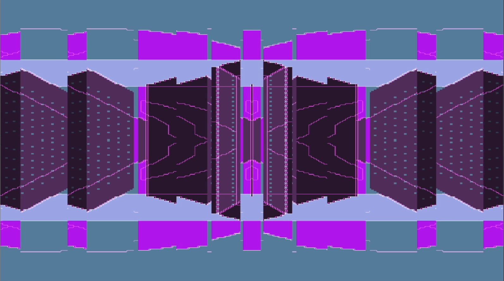

# Drifting
> A visual effects program by Zachary Picker
> zacpicker.com

'Drifting' is a visual effects program, intended for use as an art installation and as visuals to accompany live music. Low-pixel cityscapes are generated in real-time, transitioning through daytime, sunset, night, and sunrise again. As the work progresses, transformative effects are iteratively applied, forming a dreamlike narrative as the city ebbs and flows through periods of calm and periods of intense, abstracted imagery. It was most recently performed as accompaniment to an experimental electronic music set by Ayala for Concrete Dreams at Mothership Studios.

This project is also 50% an excuse for me to get more comfortable both with Github and with creating fully realized programs with Python. It's very much just a passion project and a bit of fun-- I don't intend on managing this and keeping it updated and properly tested.

Feel free to download it and enjoy it-- I recommend putting on some good ambient electronic music, or maybe something psychedelic. If you want to use it for something, just shoot me an email and give me credit (or even, some money, if you're feeling generous!). 



## Getting it going

I've frozen the program into a .exe file, but it's rather large at the moment, so I'll figure out what to do with that. I've only tested it on my win10 system, but I should be able to make an osx or linux application at some point.

Otherwise, drifting is written in python, so you can just run the code yourself. You'll need the opencv and numpy packages installed:
```sh
pip install numpy
pip install opencv-python
```
I probably won't be able to help you much with troubleshooting if things go wrong... you're on your own!

## Instructions and explanations

Honestly, just play around with it to get a feel. Pretty much everything is random and generated live, so you'll never see the same thing twice. If there was a way to make some element randomized, I probably did it.

Controls:

* space: change the 'scene' (buildings/background)
* enter: change the effect being applied to the scene
* j: next effect-type
* f: prev effect-type
* esc: quit the program
* q: quit to a black screen

Here's an explanation of the menu options:

* Mode
  * Performance: The city scenes cycle through day-night-day over the course of the alloted time. Each effect plays in turn, growing in intensity and changing style. For example, if the time is set to 10 minutes, and effect 1 takes up 1/5 of the total time, that effect will play for two minutes, gradually ramping up intensity until it stops at the 2-minute mark-- then, effect 2 begins, and so on. (This is how 'Drifting' is set up as an installation artwork).
  * Random: effects, their intensities, and times-of-day are chosen randomly.
* Performance time: amount of time the program runs for
* 'At performance end:'
  * Loop performance: at the end of the performance time, the program just starts again
  * Exit: at the end, the program quits
  * Continue last effect: at the end, the program keeps playing the final effect it was playing at full intensity.
* 'Effect-type changes:'
  * Automatically: the type of effect changes as soon as it runs out of time. For example, if effect 1 has used up its allotted two minutes, the program stops it and begins effect 2.
  * On user input: the type of effect only changes when the user uses the 'j' key to advance to the next effect (or 'f' to go back). This is useful if you want to try and time the transitions to changes in music more carefully.
* Relative time-of-day lengths: choose how long you want each portion of the day to last. These numbers are _relative_, so they don't need to add to the performance time. For example, the default is [1,2,4,2,1]; in this case, the sunset would last for 2/(1+2+4+2+1) = 1/10 of the total time.
* Relative effect-type lengths: choose how long you want each effect to play for. The numbers are relative again, just as above.
* Effect-type selection: designate a type of effect to each of the effect periods.
  * Bars: rectangular portions of the screen are swapped with each other. Progressions: both vertical and horizontal swaps, more bars, more frequent transitions
  * Mirrors: portions of the screen are mirrored. Progressions: vertical, horizontal, and diagonal swaps, and combinations of 2-3 of each to create kaleidoscope effects.
  * Outlines: buildings are outlined in neon lines. Progressions: Lines move along buildings, then building image is removed, then multiple outlines reverberate, then the edge-finding algorithm is applied every step to create interesting static, then the building image is restored.
  * All together: all the effects are combined together.
* Launch to black screen: when launched, the program goes to a black screen until you advance with space/enter/j (time doesn't start in this period). Useful for when you're setting up a projector or something and don't want to display the code/launcher before you begin.

## Meta

Your Name – [@YourTwitter](https://twitter.com/dbader_org) – YourEmail@example.com

Distributed under the XYZ license. See ``LICENSE`` for more information.

[https://github.com/yourname/github-link](https://github.com/dbader/)

## Contributing

1. Fork it (<https://github.com/yourname/yourproject/fork>)
2. Create your feature branch (`git checkout -b feature/fooBar`)
3. Commit your changes (`git commit -am 'Add some fooBar'`)
4. Push to the branch (`git push origin feature/fooBar`)
5. Create a new Pull Request

<!-- Markdown link & img dfn's -->
[npm-image]: https://img.shields.io/npm/v/datadog-metrics.svg?style=flat-square
[npm-url]: https://npmjs.org/package/datadog-metrics
[npm-downloads]: https://img.shields.io/npm/dm/datadog-metrics.svg?style=flat-square
[travis-image]: https://img.shields.io/travis/dbader/node-datadog-metrics/master.svg?style=flat-square
[travis-url]: https://travis-ci.org/dbader/node-datadog-metrics
[wiki]: https://github.com/yourname/yourproject/wiki
